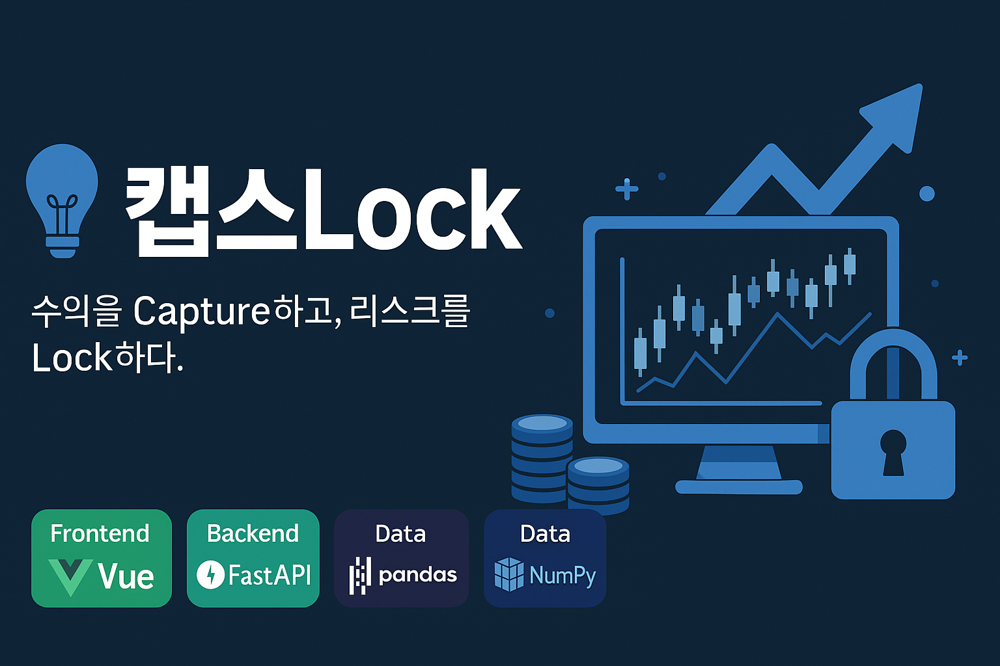

<h1 align="center">💡 캡스Lock</h1>

<em>수익을 Capture하고, 리스크를 Lock하다.</em>

  

  
  
  
  
  

---

## 👥 1. 팀 소개

### 1-1. 팀명
**캡스Lock**

### Teammates
- 20212020 박민준 (팀장)  
- 20212022 이예준  
- 20192136 이윤기  

### 1-2. 지도교수 및 멘토
- 지도교수: **정영민 교수님** (서강대학교)  
- 멘토: (추후 업데이트)  

---

## 📌 2. 프로젝트 개요

### 2-1. 과제명
**알고리즘 트레이딩 시스템 구현**

### 2-2. 슬로건
> **수익을 Capture하고, 리스크를 Lock하다.**

### 2-3. 기술 스택
- **Frontend**: Vue  
- **Backend**: FastAPI  
- **Data Processing**: Pandas, NumPy  
- **Database**: PostgreSQL  

### 2-4. 프로젝트 목표
1. 기술적 지표 기반 자동매매 시스템 구현  
2. 포트폴리오 리밸런싱 자동화 시스템 구현  
3. AI 기반 가격 예측 트레이딩 시스템 구현  

---

## 🚀 3. 프로젝트 소개
(추후 상세 소개 추가 예정)

---

## 📅 4. 프로젝트 일정
(추후 프로젝트 타임라인 또는 간트차트 추가)

---

## 📝 5. 회의록
- [2025-09-15 (월) 16:30](https://www.notion.so/2025-09-15-16-30-26fd72180f27800e8b80ef2162277207?pvs=21)  
- [2025-09-22 (월) 15:00](https://www.notion.so/2025-09-22-15-00-276d72180f278030b021c5f25e2c949d?pvs=21)  

---

## 📊 6. 발표자료
(추후 업로드)

---

## 🧩 7. 결과물
(추후 결과물 및 링크 업로드)

---

## 📑 8. 보고서
(추후 업로드)

---

  © 2025 Team 캡스Lock — All rights reserved.

